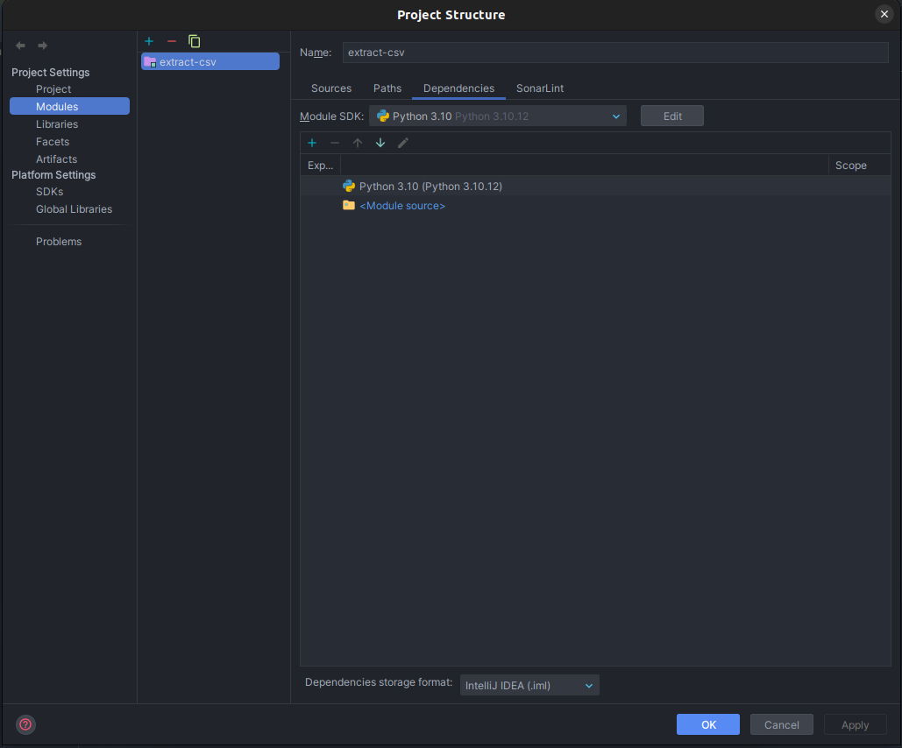
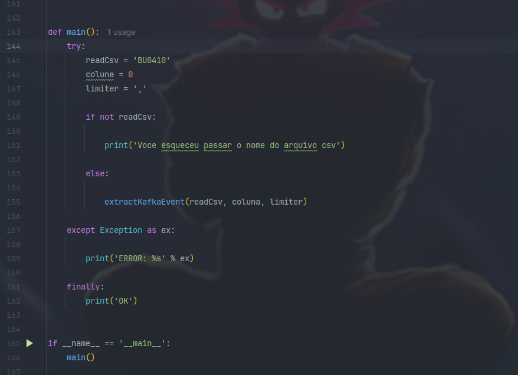

# Extract csv read and writer
### Ambiente de desenvolvimento
Tecnologias utilizadas:
* src/requirements.txt
* Docker/Docker compose

## Deverá colocar o arquivo de leitura na pasta: read  ao rodar o docker o csv será criado na pasta writer

```
.
├── docker-compose.yaml
├── README.md
└── src
    ├── Dockerfile
    ├── extract_kafka_event.py
    ├── read
    │   └── BUG410.csv
    ├── requirements.txt
    └── writer
        └── parametros_extraidos.csv

```

## Run com o docker
### No arquivo docker-compose.yaml configure o volume apontando o path do projeto ex:
```
    volumes:
      - "/home/joaozinho/Documents/extract-csv/src:/app"

```

## Build
```
docker-compose up --build
```

```
docker-compose dow
```


## Sem o Docker basta Configurar o sdk python ex: IDE intellij
### Fique avontade com outra IDE tipo PyCharm
Run 


## Execure o main clique em run

```
1 - Crie um arquivo csv e coloque na pasta ( read )

2 - Input:
readCsv =  nome do csv para leitura
coluna = posição a ser varrida na leitura do arquivo ex: 2 
limiter = separdor ex: ','
```

Run 


